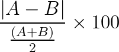

# Calculate percentage difference between 2 values

## The purpose

The purpose of this algorithm is to determine the percentage difference between 2 numbers.

## Mathematical equation


### Javascript / Typescript

```javascript
const calculateDifferenceInPercentage = (
    firstValue: number,
    secondValue: number
) => {
    const numerator = Math.abs(firstValue - secondValue)
    const denominator = Math.abs((firstValue + secondValue) / 2)
    if(denominator === 0)
        return 0

    return (numerator / denominator) * 100
}
```

```javascript
// Example
const value1 = 0.024569;
const value2 = 0.024326;
const differencePercentage = calculateDifferenceInPercentage(value1, value2);
// 0.9939666632580024
// the deviation of these numbers is around 1%
```